# bro-auth

```
┌──────────────────────────────────────────────────────────────┐
│  █▄▄ █▀█ █▀█   ▄▀█ █░█ ▀█▀ █░█      bro-auth                │
│  █▄█ █▀▄ █▄█   █▀█ █▀█ ░█░ █▀█                              │
├──────────────────────────────────────────────────────────────┤
│     Stateless JWT · Device Fingerprinting · Zero Replay      │
└──────────────────────────────────────────────────────────────┘
```

A lightweight, **stateless**, and **high-security** authentication layer that combines JWT tokens with device fingerprinting to prevent token theft and replay attacks—no database required.

[](https://www.npmjs.com/package/bro-auth)
[](https://opensource.org/licenses/MIT)

---

## 🎯 Why bro-auth?

Traditional JWT authentication has a critical weakness: **stolen tokens work from any device**. If an attacker intercepts your JWT, they can use it from anywhere until it expires.

**bro-auth solves this** by binding tokens to specific devices using browser fingerprinting. Even if a token is stolen, it won't work on a different device.

### Key Benefits

- 🔐 **Stateless JWT authentication** - No session storage needed
- 🆔 **Device fingerprint binding** - Tokens only work on the issuing device
- 🚫 **Replay attack protection** - Stolen tokens are useless on other browsers
- ⚡ **Zero dependencies** - Lightweight core (only `jsonwebtoken` + `crypto-es`)
- 🧩 **Framework agnostic** - Works with Next.js, Express, Fastify, or vanilla Node
- 🌐 **Browser module included** - Easy fingerprint extraction
- 📦 **Production ready** - TypeScript support, comprehensive error handling

---

## 📦 Installation

```bash
npm install bro-auth
```

```bash
yarn add bro-auth
```

```bash
pnpm add bro-auth
```

---

## 🧠 How It Works

```mermaid
sequenceDiagram
    participant Browser
    participant Server
    
    Browser->>Browser: Generate device fingerprint
    Browser->>Server: Login with credentials + fingerprint
    Server->>Server: Hash fingerprint (SHA-256)
    Server->>Server: Create JWT bound to fingerprint hash
    Server->>Browser: Return access + refresh tokens
    
    Browser->>Server: API request with token + fingerprint
    Server->>Server: Verify token signature
    Server->>Server: Verify fingerprint match
    Server->>Browser: Grant access ✅
    
    Note over Browser,Server: If attacker steals token...
    
    Browser->>Server: Request from different device
    Server->>Server: Fingerprint mismatch detected
    Server->>Browser: Reject request ❌
```



### The Security Flow

1. **Client generates a device fingerprint** using browser characteristics (User-Agent, screen, GPU, canvas, etc.)
2. **Server receives fingerprint** during login and creates a SHA-256 hash
3. **JWT tokens are bound** to this fingerprint hash in their payload
4. **Every request is verified** for both token validity and fingerprint match
5. **Token theft is mitigated** - stolen tokens fail fingerprint verification on different devices

---

## 🚀 Quick Start

### 1. Browser: Generate Device Fingerprint

```javascript
import { getFingerprint } from "bro-auth/browser";

async function handleLogin() {
  const fp = await getFingerprint();
  
  // Send to your login endpoint
  const response = await fetch("/api/login", {
    method: "POST",
    headers: { "Content-Type": "application/json" },
    body: JSON.stringify({
      username: "user@example.com",
      password: "password",
      fingerprint: fp.hash
    })
  });
  
  const { accessToken, refreshToken } = await response.json();
  // Store tokens securely
}
```

**Fingerprint output example:**

```json
{
  "hash": "53ff76d8a4c21b9c8e3f1a7d9e2c4b5a8f1e3d6c9b2a5e8f1d4c7b0a3e6f9c2696",
  "raw": "Mozilla/5.0|1920x1080|ANGLE (Intel, Mesa Intel UHD)|canvas_data...",
  "components": {
    "userAgent": "Mozilla/5.0 (X11; Linux x86_64)...",
    "screenResolution": "1920x1080",
    "gpu": "ANGLE (Intel, Mesa Intel UHD Graphics 620)",
    "canvas": "data:image/png;base64,iVBORw0KGgoAAAANSUhEUg...",
    "timezone": "America/New_York"
  }
}
```

### 2. Server: Generate Tokens

```javascript
import { generateTokens } from "bro-auth";

app.post("/api/login", async (req, res) => {
  const { username, password, fingerprint } = req.body;
  
  // Verify credentials (your logic here)
  const user = await verifyCredentials(username, password);
  if (!user) {
    return res.status(401).json({ error: "Invalid credentials" });
  }
  
  // Generate tokens bound to device fingerprint
  const { accessToken, refreshToken } = generateTokens({
    userId: user.id,
    fingerprintHash: fingerprint,
    accessSecret: process.env.ACCESS_SECRET,
    refreshSecret: process.env.REFRESH_SECRET,
    accessExpiresIn: "15m",  // Optional: default 15m
    refreshExpiresIn: "7d"   // Optional: default 7d
  });
  
  res.json({ accessToken, refreshToken });
});
```

### 3. Server: Verify Access Token

```javascript
import { verifyAccessToken } from "bro-auth";

app.get("/api/protected", (req, res) => {
  const token = req.headers.authorization?.replace("Bearer ", "");
  const fingerprint = req.headers["x-fingerprint"];
  
  const result = verifyAccessToken(
    token,
    fingerprint,
    process.env.ACCESS_SECRET
  );
  
  if (!result.valid) {
    return res.status(401).json({ error: result.error });
  }
  
  // Access granted
  const userId = result.payload.userId;
  res.json({ message: "Protected data", userId });
});
```

### 4. Server: Refresh Tokens

```javascript
import { verifyRefreshToken, generateTokens, buildRefreshCookie } from "bro-auth";

app.post("/api/refresh", (req, res) => {
  const { refreshToken, fingerprint } = req.body;
  
  const result = verifyRefreshToken(
    refreshToken,
    fingerprint,
    process.env.REFRESH_SECRET
  );
  
  if (!result.valid) {
    return res.status(401).json({ error: result.error });
  }
  
  // Issue new token pair
  const tokens = generateTokens({
    userId: result.payload.userId,
    fingerprintHash: fingerprint,
    accessSecret: process.env.ACCESS_SECRET,
    refreshSecret: process.env.REFRESH_SECRET
  });
  
  // Optional: Set refresh token as HTTP-only cookie
  const cookie = buildRefreshCookie(tokens.refreshToken);
  res.setHeader("Set-Cookie", cookie);
  
  res.json({ accessToken: tokens.accessToken });
});
```

---

## 📚 API Reference

### Browser Module

#### `getFingerprint(): Promise<FingerprintResult>`

Generates a unique device fingerprint from browser characteristics.

**Returns:**
```typescript
{
  hash: string;        // SHA-256 hash (send to server)
  raw: string;         // Raw concatenated fingerprint data
  components: {        // Individual fingerprint components
    userAgent: string;
    screenResolution: string;
    gpu: string;
    canvas: string;
    timezone: string;
    // ... more components
  }
}
```

### Server Module

#### `generateTokens(options): TokenPair`

Creates JWT access and refresh tokens bound to a device fingerprint.

**Parameters:**
- `userId` (string): Unique user identifier
- `fingerprintHash` (string): Device fingerprint hash from browser
- `accessSecret` (string): Secret key for access tokens
- `refreshSecret` (string): Secret key for refresh tokens
- `accessExpiresIn` (string, optional): Access token TTL (default: "15m")
- `refreshExpiresIn` (string, optional): Refresh token TTL (default: "7d")

**Returns:**
```typescript
{
  accessToken: string;
  refreshToken: string;
}
```

#### `verifyAccessToken(token, fingerprintHash, secret): VerificationResult`

Verifies an access token and its fingerprint binding.

**Returns:**
```typescript
{
  valid: boolean;
  payload?: {
    userId: string;
    fingerprintHash: string;
    iat: number;
    exp: number;
  };
  error?: string;
}
```

#### `verifyRefreshToken(token, fingerprintHash, secret): VerificationResult`

Verifies a refresh token and its fingerprint binding.

#### `buildRefreshCookie(refreshToken, options?): string`

Generates a secure HTTP-only cookie string for refresh tokens.

**Options:**
- `maxAge` (number): Cookie lifetime in seconds (default: 7 days)
- `domain` (string, optional): Cookie domain
- `sameSite` ("Strict" | "Lax" | "None"): SameSite policy (default: "Strict")
- `secure` (boolean): HTTPS only (default: true)

---

## 🔒 Security Best Practices

### 1. Environment Variables

Never hardcode secrets. Use environment variables:

```bash
# .env
ACCESS_SECRET=your-super-secret-access-key-min-32-chars
REFRESH_SECRET=your-super-secret-refresh-key-min-32-chars
```

### 2. Token Storage

**Access tokens:**
- Store in memory (React state, Vue reactive)
- Never in localStorage (XSS vulnerable)

**Refresh tokens:**
- Use HTTP-only cookies (best)
- Or secure memory storage with HTTPS

### 3. HTTPS Only

Always use HTTPS in production to prevent man-in-the-middle attacks.

### 4. Short-lived Access Tokens

Keep access token TTL short (5-15 minutes) to limit exposure window.

### 5. Token Rotation

Rotate refresh tokens on each use to detect token theft:

```javascript
// When refreshing, invalidate old refresh token
// and issue a new pair
```

---

## 🎨 Integration Examples

### Next.js App Router

```typescript
// app/api/login/route.ts
import { generateTokens } from "bro-auth";
import { NextRequest, NextResponse } from "next/server";

export async function POST(req: NextRequest) {
  const { username, password, fingerprint } = await req.json();
  
  // Your auth logic
  const user = await authenticate(username, password);
  
  const tokens = generateTokens({
    userId: user.id,
    fingerprintHash: fingerprint,
    accessSecret: process.env.ACCESS_SECRET!,
    refreshSecret: process.env.REFRESH_SECRET!
  });
  
  return NextResponse.json(tokens);
}
```

### Express.js Middleware

```javascript
import { verifyAccessToken } from "bro-auth";

export const authMiddleware = (req, res, next) => {
  const token = req.headers.authorization?.replace("Bearer ", "");
  const fingerprint = req.headers["x-fingerprint"];
  
  const result = verifyAccessToken(
    token,
    fingerprint,
    process.env.ACCESS_SECRET
  );
  
  if (!result.valid) {
    return res.status(401).json({ error: "Unauthorized" });
  }
  
  req.userId = result.payload.userId;
  next();
};

// Usage
app.get("/api/user", authMiddleware, (req, res) => {
  res.json({ userId: req.userId });
});
```

---

## ❓ FAQ

### Q: Can users have multiple devices?

**A:** Yes! Each device generates its own fingerprint. Issue separate token pairs for each device. You can track active sessions by storing fingerprint hashes (optional).

### Q: What if fingerprint changes (browser update, etc.)?

**A:** The user will need to re-authenticate. This is a security feature—it prevents fingerprint spoofing. Consider implementing a "trusted devices" system for better UX.

### Q: Is this more secure than sessions?

**A:** It's different. Sessions require server-side storage but can be invalidated instantly. bro-auth is stateless (scales better) but tokens can't be revoked until expiry. Choose based on your needs.

### Q: What about privacy?

**A:** The fingerprint is hashed with SHA-256 before storage. Only the hash is sent to the server—individual components stay client-side. However, browser fingerprinting can be privacy-sensitive, so disclose this in your privacy policy.

### Q: Does this work with mobile apps?

**A:** The browser module is web-only. For mobile apps, generate a device ID using native APIs (iOS: `identifierForVendor`, Android: `ANDROID_ID`) and use that as the fingerprint.

---

## 🤝 Contributing

Contributions are welcome! Please feel free to submit a Pull Request.

1. Fork the repository
2. Create your feature branch (`git checkout -b feature/amazing-feature`)
3. Commit your changes (`git commit -m 'Add amazing feature'`)
4. Push to the branch (`git push origin feature/amazing-feature`)
5. Open a Pull Request

---

## 📄 License

MIT © [Your Name]

---

---

## 🔗 Links

- [NPM Package](https://www.npmjs.com/package/bro-auth)
- [GitHub Repository](https://github.com/ChakraVaishnav/bro-auth)

---

**Made with 💪 by developers who care about security**